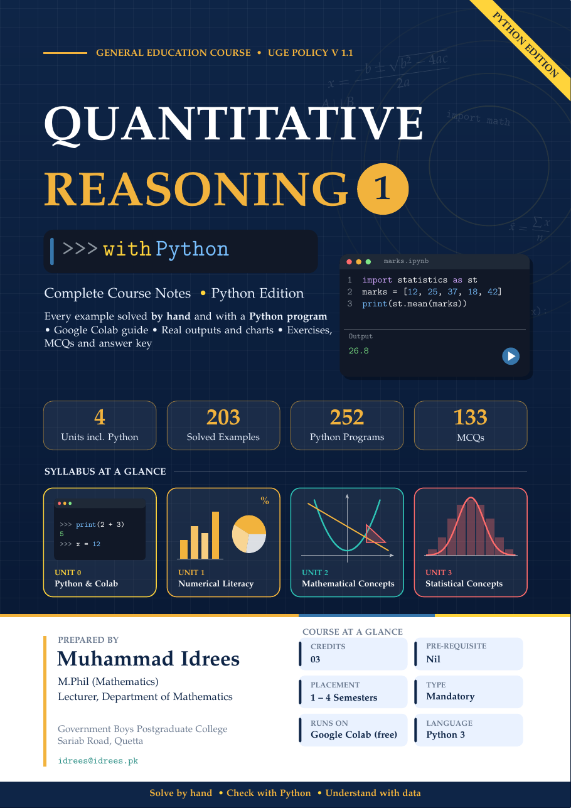

<div align="center">

# 📘 Quantitative Reasoning 1 with Python

**Complete course notes for Quantitative Reasoning (I), with every example solved by hand and with Python**

*General Education Course · First Edition · 3 Credit Hours*




</div>

---

## About the book

**Quantitative Reasoning (I)** is a mandatory General Education course taken by undergraduate students of every field. It builds the ability to work with numbers, understand mathematical and statistical ideas, and interpret data in tables, graphs, charts and equations.

This book covers the full syllabus with one simple habit:

> ✍️ **Solve it by hand** → 💻 **check it with Python** → 📊 **understand what the numbers mean**

Every example is first worked out **step by step**, with a short *"Why?"* note on the key steps. It is then solved again with a short **Python program** that follows the same steps. Each program in the book is shown with its **real output and charts**.

No installation is needed. All programs run free in a web browser on **Google Colab**, and **Unit 0** teaches the Python you need from scratch.

## What's in this repository

| File | Description |
|---|---|
| 📕 [`QR1_with_Python.pdf`](QR1_with_Python.pdf) | The complete book (181 pages) |
| 📓 [`Unit0_Python_Fundamentals_and_Google_Colab.ipynb`](Unit0_Python_Fundamentals_and_Google_Colab.ipynb) | Unit 0 programs (49) |
| 📓 [`Unit1_Numerical_Literacy.ipynb`](Unit1_Numerical_Literacy.ipynb) | Unit 1 programs (71) |
| 📓 [`Unit2_Fundamental_Mathematical_Concepts.ipynb`](Unit2_Fundamental_Mathematical_Concepts.ipynb) | Unit 2 programs (70) |
| 📓 [`Unit3_Fundamental_Statistical_Concepts.ipynb`](Unit3_Fundamental_Statistical_Concepts.ipynb) | Unit 3 programs (62) |

## ▶️ Open the notebooks in Google Colab

Click a badge to open that unit's notebook directly in Colab:

| Unit | Open in Colab |
|---|---|
| **Unit 0:** Python Fundamentals and Google Colab | [](https://colab.research.google.com/github/USERNAME/REPO/blob/main/Unit0_Python_Fundamentals_and_Google_Colab.ipynb) |
| **Unit 1:** Numerical Literacy | [](https://colab.research.google.com/github/USERNAME/REPO/blob/main/Unit1_Numerical_Literacy.ipynb) |
| **Unit 2:** Fundamental Mathematical Concepts | [](https://colab.research.google.com/github/USERNAME/REPO/blob/main/Unit2_Fundamental_Mathematical_Concepts.ipynb) |
| **Unit 3:** Fundamental Statistical Concepts | [](https://colab.research.google.com/github/USERNAME/REPO/blob/main/Unit3_Fundamental_Statistical_Concepts.ipynb) |

**How to use a notebook**
1. Click a badge above and sign in with your Google (Gmail) account.
2. Run a cell with the ▶ button or **Shift + Enter**. The output appears below the cell.
3. Each cell is one example from the book and is complete on its own, so you can run cells in any order.
4. To keep your own copy with your changes, choose **File → Save a copy in Drive**.

You can also download a notebook from this repository and open it in Colab with **File → Upload notebook**.

## 📚 Contents

<details>
<summary><b>Unit 0: Python Fundamentals and Google Colab</b></summary>

0.1 Getting Started: Python and Google Colab ·
0.2 Variables, Data Types and Arithmetic ·
0.3 Strings, Printing and Formatting Output ·
0.4 Lists, Tuples, Dictionaries and Sets ·
0.5 Making Decisions: Conditions ·
0.6 Repetition: Loops and Comprehensions ·
0.7 Functions ·
0.8 Python Libraries for Mathematics ·
0.9 Algebra with SymPy ·
0.10 Matplotlib, NumPy and SciPy
</details>

<details>
<summary><b>Unit 1: Numerical Literacy</b></summary>

1.1 Number System and Basic Arithmetic Operations ·
1.2 Units, Conversions, Dimensions, Area, Perimeter and Volume ·
1.3 Rates, Ratios, Proportions and Percentages ·
1.4 Types and Sources of Data ·
1.5 Measurement Scales ·
1.6 Tabular and Graphical Presentation of Data ·
1.7 Quantitative Reasoning Exercises Using Number Knowledge
</details>

<details>
<summary><b>Unit 2: Fundamental Mathematical Concepts</b></summary>

2.1 Basics of Geometry (Lines, Angles, Circles, Polygons) ·
2.2 Sets and their Operations ·
2.3 Relations, Functions and their Graphs ·
2.4 Exponents, Factoring and Simplifying Algebraic Expressions ·
2.5 Linear and Quadratic Equations and Inequalities (Algebraic and Graphical) ·
2.6 Quantitative Reasoning Exercises Using Mathematical Concepts
</details>

<details>
<summary><b>Unit 3: Fundamental Statistical Concepts</b></summary>

3.1 Population and Sample ·
3.2 Measures of Central Tendency, Dispersion and Data Interpretation ·
3.3 Rules of Counting (Multiplicative, Permutation and Combination) ·
3.4 Basic Probability Theory ·
3.5 Introduction to Random Variables and their Probability Distributions ·
3.6 Quantitative Reasoning Exercises Using Statistical Concepts
</details>

## ✨ Features

- **Key concepts and formulas** for every topic, in simple words
- **203 solved examples**, each worked step by step, from everyday Pakistani contexts such as electricity bills charged in slabs, fuel costs, budgets, prices and test results
- **252 Python programs**, each shown in the book with its real output and Matplotlib charts
- **Exercises** for every topic, to solve by hand and then check with Python
- **133 multiple-choice questions** for quick self-tests
- **A summary** at the end of every topic
- **A complete answer key** for all exercises and MCQs
- A **Google Colab guide**, so students need only a browser and a Gmail account

## 🧰 Python libraries used

| Library | Used for |
|---|---|
| `math`, `fractions` | arithmetic, HCF/LCM, exact fractions, factorials, combinations |
| `statistics`, `random`, `itertools` | averages, spread, simulation, counting arrangements |
| `sympy` | algebra: expanding, factorising, solving equations and inequalities |
| `numpy`, `matplotlib` | calculations on arrays, graphs and charts |
| `scipy` | binomial and normal probabilities |

All of these come pre-installed on Google Colab.

**Running on your own computer:** install Python 3.10 or newer, then run

```bash
pip install numpy sympy matplotlib scipy jupyter
jupyter notebook
```

## 🎓 Who is this for?

- **Undergraduate students** taking Quantitative Reasoning (I), in any field
- **Teachers** looking for ready examples, exercises and a practical way to bring Python into the course
- **Anyone** who wants to strengthen numerical, data and probability skills while learning beginner Python

## 👤 Author

**Muhammad Idrees**
M.Phil (Mathematics)
Lecturer, Department of Mathematics
Government Boys Postgraduate College, Sariab Road, Quetta
📧 [idrees@idrees.pk](mailto:idrees@idrees.pk)

## 📝 Feedback

Found a mistake, or have a suggestion? Please [open an issue](../../issues) or send an email. Feedback from students and teachers is very welcome.

## © Copyright and use

© 2026 Muhammad Idrees. All rights reserved.

You are welcome to read, download and use this book and its notebooks for personal study and classroom teaching. Please credit the author when sharing. Do not sell or republish the book, in whole or in part, without permission.

---

<div align="center">

**Solve by hand · Check with Python · Understand with data**

⭐ If this book helps you, please star the repository and share it with your classmates and colleagues.

</div>
